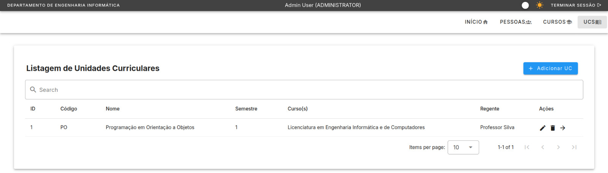
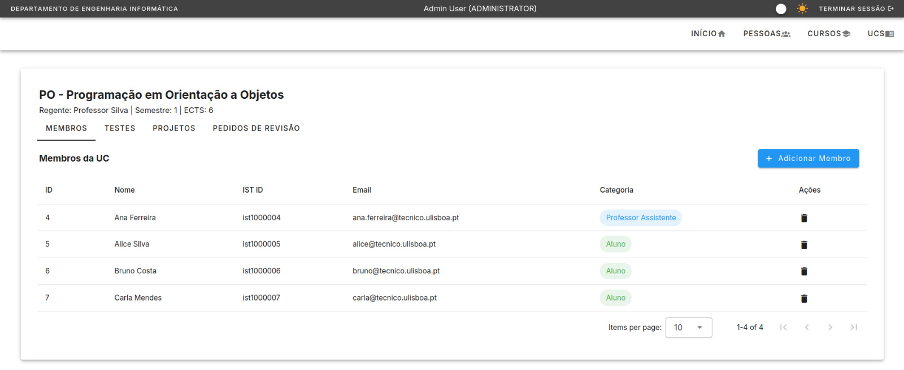
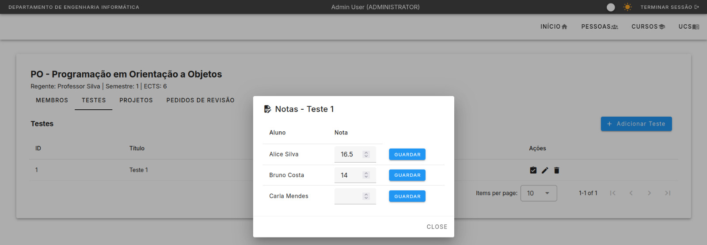
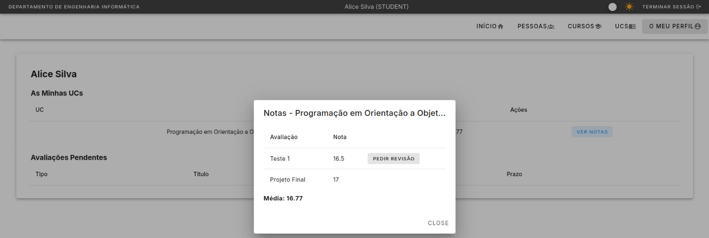

# AcaMS — Academic Management System

A full-stack academic management platform for university departments: course/curriculum management, role-based access control, grading with weighted averages, group project assignment, and a complete exam-review workflow with multi-stage approval.

Built with **Spring Boot** (Java 21) + **PostgreSQL** on the backend, and **Vue 3** + **TypeScript** + **Vuetify** on the frontend, with **JWT-based authentication** and fine-grained authorization throughout.

## Live Demo

🔗 [https://acams-ist.vercel.app](https://acams-ist.vercel.app)

> **Note:** All accounts below are seeded demo data for testing purposes only — they do not correspond to real IST students, staff, or email addresses.

| Role | Email | Password |
|---|---|---|
| Administrator | admin@tecnico.ulisboa.pt | admin123 |
| Regente (Professor) | prof.silva@tecnico.ulisboa.pt | prof123 |
| Teaching Assistant | ana.ferreira@tecnico.ulisboa.pt | pass123 |
| Student | alice@tecnico.ulisboa.pt | pass123 |

## Highlights

- **Multi-layered authorization** — beyond simple role checks, several endpoints enforce *ownership*-based rules (e.g., only a UC's actual Regente — not just any teacher — can manage its members or grade its evaluations) and *self-or-privileged* access (a student can only view their own profile/grades, unless the requester is an Administrator)
- **A full approval workflow** — exam grade reviews move through a 4-stage state machine (student request → optional assistant opinion → regente decision → recorded history), with transitions validated server-side at every step
- **Business-rule enforcement, not just CRUD** — test/project weights are validated against a per-UC budget (can't exceed 100%), group sizes are enforced, duplicate data (emails, course codes, evaluation titles) is rejected with specific, human-readable error messages rather than raw database errors
- **Clean separation of read/write DTOs** throughout — sensitive fields (like password hashes) are structurally impossible to leak through the API, since read and write shapes are distinct types

## Screenshots

<details>
<summary>Click to expand</summary>

### UCs List


### UC Details


### Grading View


### Student Profile + grades


</details>

## Tech Stack

**Backend:** Java 21, Spring Boot, Spring Security, Spring Data JPA, PostgreSQL, JWT (jjwt), BCrypt
**Frontend:** Vue 3 (Composition API), TypeScript, Vuetify, Pinia, Axios
**Infra:** Docker (local Postgres), Vercel (frontend), Render (backend)

## Core Features

- **Authentication & Authorization** — JWT login, role-based (`ADMINISTRATOR`, `MAIN_TEACHER`, `TEACHING_ASSISTANT`, `STUDENT`) and ownership-based access control
- **Course & UC Management** — full CRUD, many-to-many Course↔UC relationships, regente assignment
- **UC Membership** — enrolling students and assistants, managed by the UC's own regente
- **Tests & Projects** — creation with weight-budget enforcement, individual or group-based projects, manual or automatic random group assignment
- **Grading** — per-student or per-group grading, re-gradable, with score validation
- **Weighted Grade Averages** — computed per-UC, excluding ungraded evaluations rather than treating them as zero
- **Exam Review Workflow** — student-initiated grade review requests with a full multi-stage approval process
- **Student Profiles** — a self-service view of enrolled UCs, computed averages, and pending evaluations

<details>
<summary>Full technical breakdown of each feature (click to expand)</summary>

### Authentication
- JWT-based login: `POST /auth/login` with email + password, returns a signed token
- Passwords hashed with BCrypt (`Person.password` never exposed via API — see `PersonDto` vs `CreatePersonDto` split)
- `JwtAuthFilter` validates the `Authorization: Bearer <token>` header on protected routes and populates Spring Security's context with the authenticated user's identity and role
- `POST /people` is currently open/unauthenticated to avoid a bootstrapping problem (can't create the first account if creation itself requires login); revisit once an initial Admin is seeded via `populate.sql`

### Courses & UCs
- Full CRUD for `Course` (`/courses`) and `Uc` (`/ucs`)
- A UC has one Regente (`MAIN_TEACHER`) and belongs to one or more Courses (many-to-many)
- Creating/updating a UC validates that the assigned regente is actually a `MAIN_TEACHER`
- Creating, updating, and deleting UCs is restricted to Administrators (`@PreAuthorize`); viewing is open to any authenticated user

### UC Membership
- Regente (or Admin) can add/remove Alunos and Assistentes for their UC (`/ucs/{ucId}/members`)
- Authorization is ownership-based: only the UC's actual Regente or an Administrator can manage its members, not just any teacher
- Duplicate memberships are rejected; viewing members is open to any authenticated user

### Evaluations (Tests & Projects)
- Tests (`/ucs/{ucId}/tests`) and Projects (`/ucs/{ucId}/projects`) are managed by the UC's Regente or an Administrator
- Projects can be individual or group-based (`isGroupProject`), with an enforced `maxGroupSize`
- Project groups (`/projects/{projectId}/groups`) can be created manually or auto-assigned randomly among the UC's enrolled students; auto-assignment is a one-time operation and will reject subsequent runs once groups already exist

### Grading
- Grades can be assigned by the UC's Regente, its Assistentes, or an Administrator — a broader set of roles than evaluation creation, matching the distinction between defining an evaluation and grading it
- A grade is tied to either a Test or a Project, and either an individual student or a project group, never both — enforced in `GradeService`
- Re-submitting a grade for the same test/person (or project/group) updates the existing grade rather than creating a duplicate
- Scores are validated to be within 0–20

### Grades View
- `GET /api/ucs/{ucId}/students/{personId}/grades` returns a student's grades in a UC plus a computed weighted average
- Average is computed only from evaluations that have been graded so far (ungraded evaluations are excluded rather than counted as zero) — weights re-normalize automatically as more grades are added through the semester
- Viewable by the student themselves, the UC's Regente or Assistentes, or an Administrator
- Test/Project creation enforces a weight budget: the sum of all weights in a UC cannot exceed 1.0 (with small floating-point tolerance), checked on both create and update

### Exam Review Workflow
- `POST /review-requests` — student submits a review request for a test grade, with justification and deadline
- `POST /review-requests/{id}/assistant-opinion` — Regente, Assistente, or Admin adds an opinion (optional step)
- `POST /review-requests/{id}/decide` — only the UC's Regente or an Admin can make the final approve/reject decision
- Full history is preserved on a single record (justification, opinion, decision) rather than a separate audit table — sufficient given each transition is timestamped and nothing is overwritten
- Grade changes resulting from an approved review are not automatic — the professor manually re-grades via the existing grading endpoint if the outcome warrants a score change, since the correct adjustment amount isn't derivable from the workflow itself

### Student Profile
- `GET /api/students/{studentId}/profile` — returns enrolled UCs with computed averages, plus pending (ungraded) tests and projects
- Visible only to the student themselves or an Administrator
- "Projetos submetidos" (submitted project files) tracking was simplified out — the current model tracks grading completeness as a proxy for pending work, not actual file submission state, since no submission/file-upload entity was built

</details>

## Running Locally

### Prerequisites
- [Java 21](https://www.oracle.com/java/technologies/downloads/#java21)
- [Maven](https://maven.apache.org/download.cgi)
- [Node 18+](https://nodejs.org/en/)
- [Docker](https://www.docker.com/)

### 1. Clone and enter the project
```bash
git clone https://github.com/surtricecream/Academic-Management-System.git
cd Academic-Management-System
```

### 2. Start the database
```bash
docker compose up -d
```

### 3. Backend
```bash
cp backend/src/main/resources/application.properties.example backend/src/main/resources/application.properties
cd backend
mvn clean spring-boot:run
```

### 4. Frontend
```bash
cp frontend/example.env frontend/.env
cd frontend
npm install
npm run dev
```

The app will be available at `http://localhost:5173`, connecting to the backend at `http://localhost:8080`.

### Accessing the database directly
```bash
psql -h localhost -p 7654 -U postgres deidb
```

## Known Simplifications

A few intentional scope decisions, documented rather than hidden:
- No file-upload/submission tracking for project deliverables — the system tracks grading state as a proxy for completion
- Grade changes from an approved exam review are applied manually, not automatically, since the correct adjustment isn't derivable from the workflow alone
- Group auto-assignment is a one-time operation per project; re-running it after groups exist is rejected rather than creating duplicates
